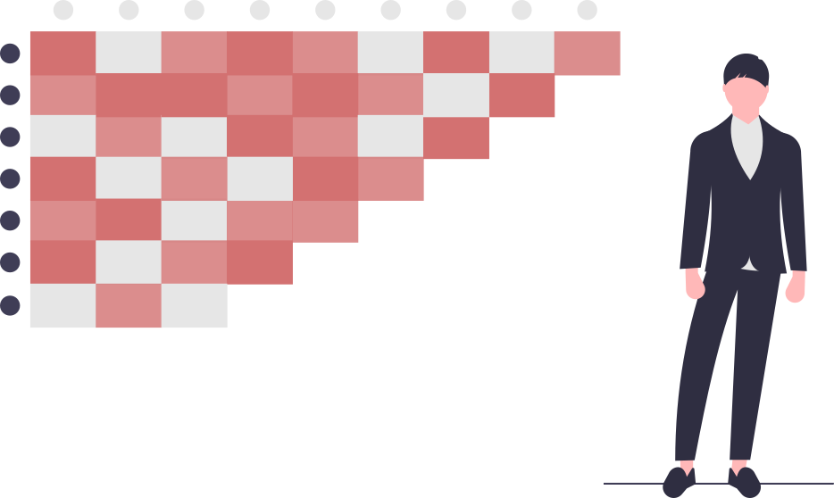

    

    

* :file_folder: assets
    * `pratica7-8_LS8_B2_B7.hdr` 
    * `pratica7-8_LS8_B2_B7.tif`
* :file_folder: data
    * `log`
    * `samples.cpg`
    * `samples.dbf`
    * `samples.prj`
    * `samples.shp`
    * `samples.shx`
    * `samples.gsg`
* :file_folder: document
    * `main.aux`
    * `main.log`
    * `main.out`
    * 
    * `main.synctex.gz`
    * `main.tex`
    * `titlepage.pdf`
* :file_folder: images
    * :file_folder: SoloSecoExp
        * `432.png`
        * `564.png`
        * `class.png`
    * :file_folder: SoloUmidoExp
        * `432.png`
        * `564.png`
        * `class.png`
    * :file_folder: agua
        * `432.png`
        * `564.png`
        * `class.png`
    * :file_folder: areaUrbana
        * `432.png`
        * `564.png`
        * `class.png`
    * :file_folder: florestaPlantada
        * `432.png`
        * `564.png`
        * `class.png`
    * :file_folder: povosVeg
        * `432.png`
        * `564.png`
        * `class.png`
    * :file_folder: vegetacaoNatural
        * `432.png`
        * `564.png`
        * `class.png`
    * `analysis.svg`
    * `classification.pdf`
    * `default.pdf`
    * `frame.svg`
    * `print_432.pdf`
    * `print_564.pdf`
    * `print_classification.pdf`
    * `rgb432.pdf`
    * `rgb564.pdf`
* `README.md`
* `classification.mxd`
* `composition.mxd`